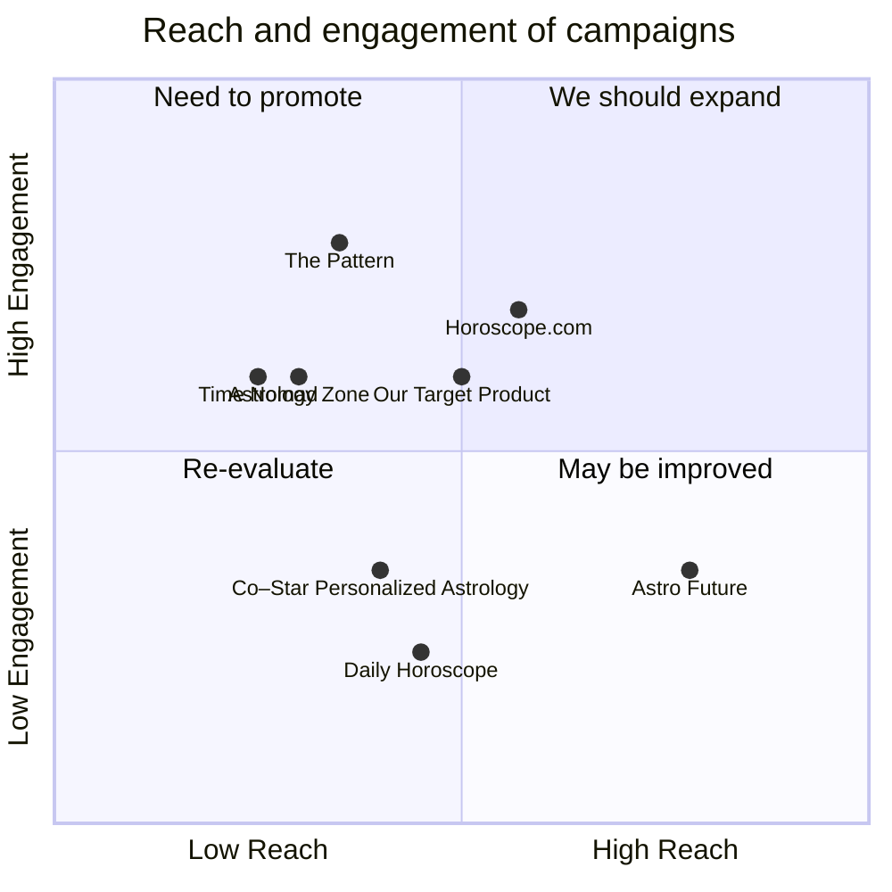

## Original Requirements
The boss wants a WeChat mini app developed that can predict the user's fortune for the day.

## Product Goals
```python
[
    "Create an engaging WeChat mini app",
    "Provide accurate daily fortune predictions",
    "Ensure user-friendly interface and experience"
]
```

## User Stories
```python
[
    "As a user, I want to check my fortune for the day so that I can plan accordingly",
    "As a user, I want to share my daily fortune on social media to engage with my friends",
    "As a user, I want to see past predictions to track the accuracy of the app",
    "As a user, I want an easy to use interface so that I can navigate the app without confusion",
    "As a user, I want to receive notifications about my daily fortune so I don't forget to check"
]
```

## Competitive Analysis
```python
[
    "Astrology Zone: Provides detailed monthly horoscopes but lacks daily predictions",
    "Daily Horoscope: Offers daily predictions but lacks a user-friendly interface",
    "Horoscope.com: Provides daily, weekly, and monthly predictions but lacks a social sharing feature",
    "Astro Future: Offers detailed astrological profiles but lacks daily predictions",
    "Co–Star Personalized Astrology: Provides personalized horoscopes but lacks a simple user interface",
    "The Pattern: Offers in-depth personality analysis but lacks daily horoscope predictions",
    "Time Nomad: Provides detailed astrological charts but lacks simplicity for casual users"
]
```

## Competitive Quadrant Chart


## Requirement Analysis
The product should be a WeChat mini app that provides daily fortune predictions. It should have a user-friendly interface and allow users to share their predictions on social media. The app should also provide a history of past predictions and send daily notifications to users.

## Requirement Pool
```python
[
    ("Develop a daily fortune prediction algorithm", "P0"),
    ("Implement a user-friendly interface", "P0"),
    ("Add a feature for sharing predictions on social media", "P1"),
    ("Create a history feature for past predictions", "P1"),
    ("Develop a notification system for daily fortunes", "P2")
]
```

## UI Design draft
The app should have a clean and simple design, with a main screen displaying the daily fortune. There should be a navigation bar at the bottom with options for 'Today', 'History', and 'Share'. 'Today' will show the current day's prediction, 'History' will show past predictions, and 'Share' will allow users to share their prediction on social media.

## Anything UNCLEAR
There are no unclear points.