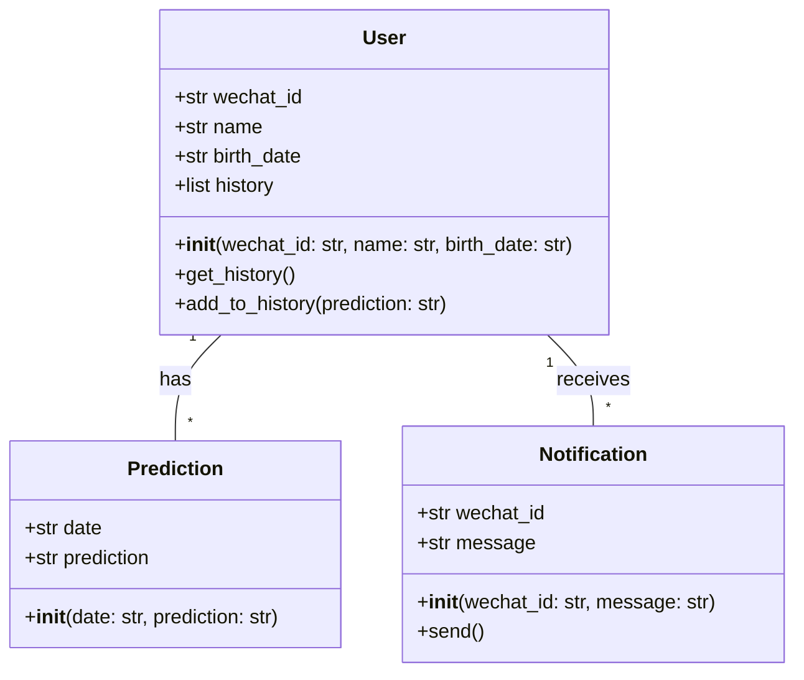
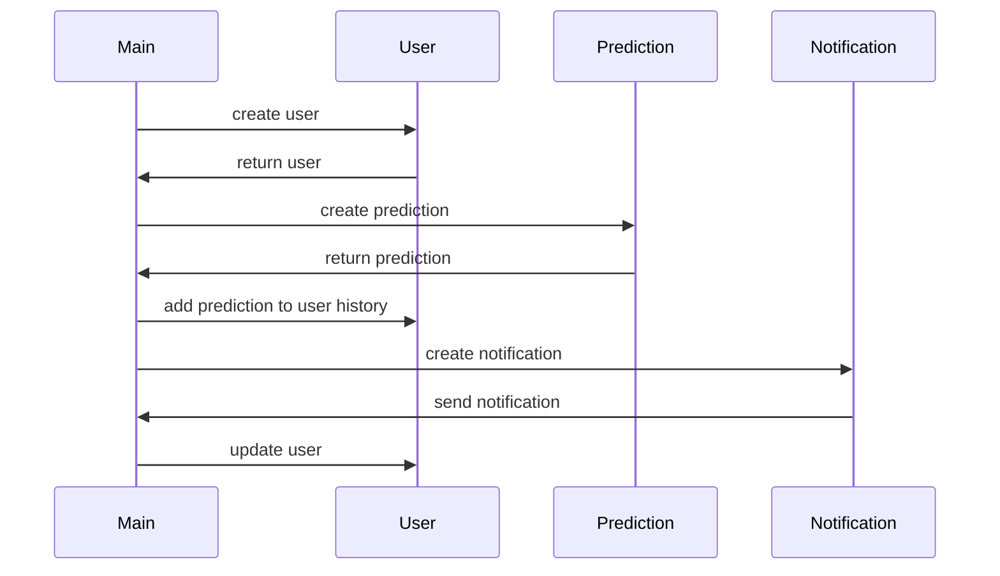

## Implementation approach
We will use the Flask framework to build the backend of the WeChat mini app. Flask is a lightweight and flexible Python web framework that is suitable for small to medium projects. For the daily fortune prediction algorithm, we will use the AstroPy library, which is a powerful open-source software for astronomy. We will use the WeChat API for sending notifications and sharing on social media. The user interface will be built with HTML, CSS, and JavaScript. 

## Python package name
```python
"wechat_fortune"
```

## File list
```python
[
    "main.py",
    "prediction.py",
    "notification.py",
    "history.py",
    "share.py",
    "templates/index.html",
    "static/css/main.css",
    "static/js/main.js"
]
```

## Data structures and interface definitions


## Program call flow


## Anything UNCLEAR
The requirement is clear to me. However, the actual implementation may require further clarification on the specific requirements of the WeChat API, as well as the details of the prediction algorithm.